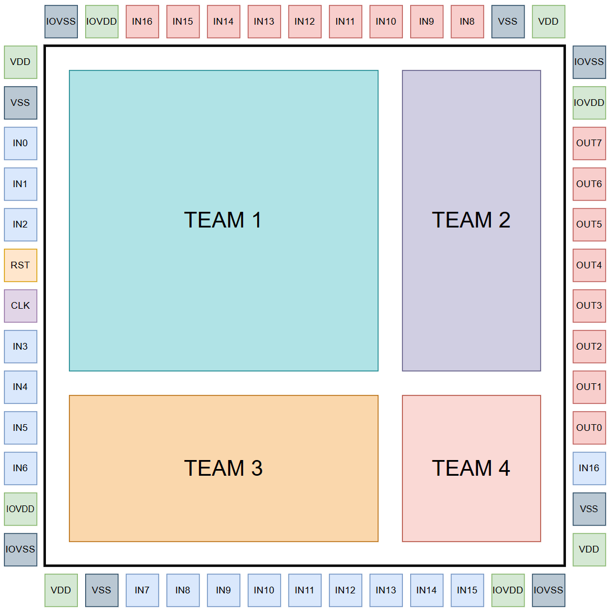

# UNIC-CASS-WRAPPER-TOMAR2026

> **Project Status:**
>This repository contains the official wrapper and integration environment used for the UNIC-CASS TOMAR 2026 tapeout. It defines the chip-level architecture, integration flow, and layout structure used to assemble all participating designs into a manufacturable chip using the IHP open-source PDK.

Table of contents
=================

1. [Overview](#overview)
2. [Quick Start](#quick-start)
3. [GPIO Configuration](#gpio-configuration)
4. [Layout Integration](#layout-integration)

Overview
========

The UNIC-CASS Wrapper is the chip-level integration framework used for the UNIC-CASS TOMAR 2026 tapeout.

Inspired by the Caravel integration concept, this repository provides a standardized wrapper architecture that enables multiple independent designs to be integrated into a single manufacturable chip.

Unlike Caravel, the UNIC-CASS wrapper does not implement a System-on-Chip (SoC). Instead, it serves as a generic chip integration template where user-contributed macros can be placed, interconnected, and prepared for fabrication.

The wrapper provides:

- A predefined top-level chip architecture
- A standardized GPIO interface
- A layout integration structure
- A reproducible open-source physical design flow

This repository is part of the Universalization of IC Design from CASS (UNIC-CASS) program — an initiative aimed at democratizing chip design education and fabrication through open-source tools, workflows, and PDKs.

Tapeout Structure
=================

The final chip integrates multiple user designs inside a shared wrapper as the image below shows.

Each participant contributes one or more hardened macros, which are then placed inside the user_project_wrapper.

The wrapper defines:

- chip I/O interface
- pad connections
- macro placement
- chip-level physical verification

The final layout produced by this repository corresponds to the GDS submitted for fabrication.



Quick Start
===========

### Starting Your Project

1. Create a new repository based on the unic-cass-wrapper-TOMAR2026 template. Ensure your repo is public and includes a README.
    - Follow [this link](https://github.com/unic-cass/unic-cass-wrapper-TOMar2026/fork) to create your repository.
    - Clone the repository using:
        ```
        git clone <your GitHub repo URL>
        ```
2. Set up your local environment:
    ```
    cd <project_name>
    make setup
    ```
    This command installs:
    1. Submodules
3. Start hardening your design:
    - Create a subdirectory for each macro in your project under the unic_cass_user_project/ directory with Librelane configuration files.
    - Provide an RTL Verilog model of your design to Librelane.
        ```
        cd unic_cass_wrapper_user_project
        make <module_name>
        ```
4. Integrate modules into the unic_cass_wrapper_2x2:
    1. Instantiate your module(s) in ```src/user_project_wrapper_2x2.sv```.
    2. Update the macros in the ```unic_cass_wrapper_2x2/config.json``` file. Make sure to provide:
        - your design names
        - GDS path
        - LEF path
        - NL (netlist) path
        - LIB path
        - SPEF path
        - Module instances with the desired position
    3. Harden the user_project_wrapper with your module(s):
        ```
        cd unic_cass_wrapper_2x2
        make
        ```
